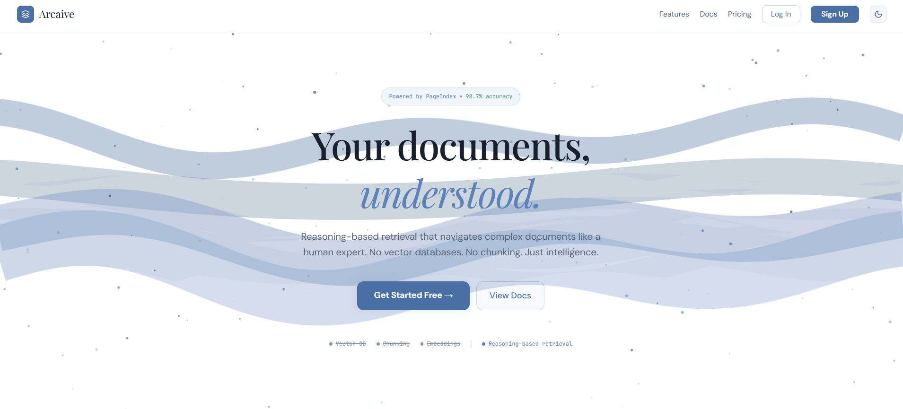
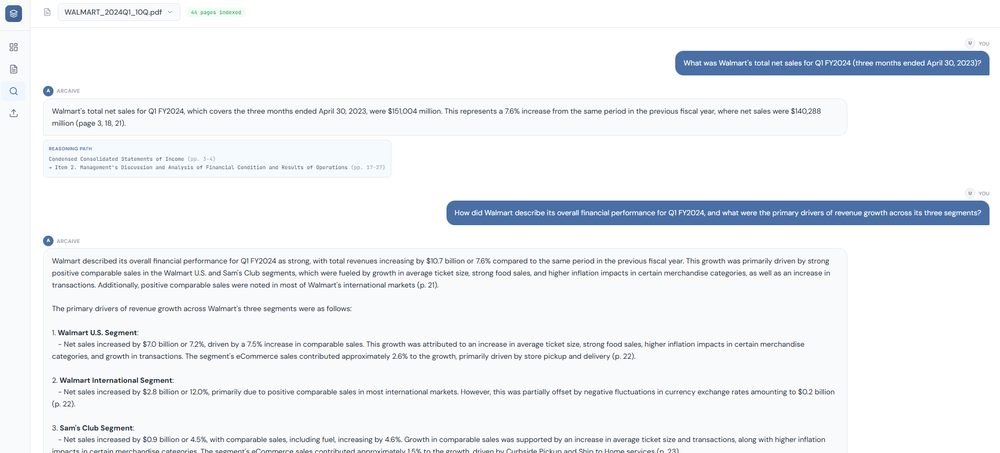
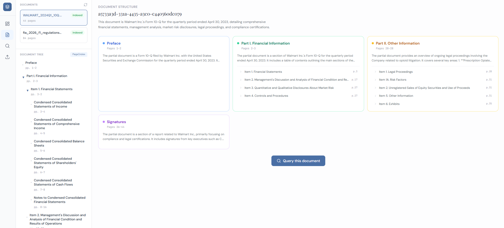

<div align="center">


<br /><br />

# Arcaive

### Reasoning-Based Document Intelligence

Upload any PDF. Get answers that trace exactly **how** and **where** the information was found.

No vector databases. No chunking. No embeddings. Just reasoning.

<br />

[Live Demo](https://arcaive-app.vercel.app) · [API Docs](https://web-production-4a200.up.railway.app/docs) · [Report Bug](https://github.com/Saurabh-Vyawahare/Arcaive/issues)

<br />



</div>

<br />

## The Problem with Traditional RAG

Most RAG systems follow the same pipeline: chunk your document into pieces, embed them into vectors, store in a vector database, then use cosine similarity to find "relevant" chunks.

**The issue?** Similarity ≠ relevance.

When you embed a 200-page financial report and ask "What are the risk factors?", cosine similarity might return chunks that *sound* related but miss the actual Risk Factors section entirely. There's no structural understanding — it's pattern matching, not comprehension.

## How Arcaive Solves This

Arcaive uses **PageIndex** — a reasoning-based retrieval framework that achieved **98.7% accuracy on FinanceBench**, significantly outperforming vector-based RAG.

```
Traditional RAG                              Arcaive
─────────────                              ───────
PDF                                         PDF
 ↓                                           ↓
Chunk into 1000-char pieces                 PageIndex reads every page
 ↓                                           ↓
Embed with ada-002                          Builds hierarchical tree structure
 ↓                                           ↓
Store in Pinecone/Weaviate                  Tree stored in PostgreSQL (JSONB)
 ↓                                           ↓
Cosine similarity search                    LLM reasons THROUGH the tree
 ↓                                           ↓
Hope you got the right chunks               Identifies exact pages
 ↓                                           ↓
Feed to LLM                                 Generates answer + reasoning trace
```

**Every answer includes a reasoning path** — which sections of the document were used and why. No black boxes.

<br />

<div align="center">

</div>

<br />

## Features

| Feature | Description |
|---------|-------------|
| **🌲 Tree-Based Indexing** | Documents become intelligent hierarchies — not flat chunks |
| **🧠 LLM Reasoning** | GPT-4o thinks through document structure to find answers |
| **🔍 Full Traceability** | Every answer shows the reasoning path with page references |
| **📄 Any PDF** | Research papers, legal docs, financial reports, textbooks |
| **⚡ Background Processing** | Upload returns instantly — tree builds asynchronously |
| **🗑️ Document Management** | Upload, view, query, and delete documents |
| **🔐 JWT Authentication** | Secure signup/login with bcrypt password hashing |
| **🌓 Dark/Light Theme** | Toggle between themes on the landing page |
| **📱 Interactive Tree Viewer** | Visual card grid of document structure |

<br />

## Architecture

```
┌─────────────────────────────────────────────────────────┐
│                        Frontend                          │
│              React + Vite + Tailwind CSS                 │
│         Deployed on Vercel (free, permanent)             │
└──────────────────────┬──────────────────────────────────┘
                       │ HTTPS
┌──────────────────────▼──────────────────────────────────┐
│                     FastAPI Backend                       │
│                  Deployed on Railway                      │
│                                                          │
│  ┌──────────┐  ┌──────────────┐  ┌───────────────────┐  │
│  │  Auth     │  │  Documents   │  │  Query            │  │
│  │  JWT +    │  │  Upload +    │  │  Tree reasoning + │  │
│  │  bcrypt   │  │  Background  │  │  Context extract  │  │
│  │          │  │  processing  │  │  + LLM answer     │  │
│  └──────────┘  └──────┬───────┘  └────────┬──────────┘  │
│                       │                    │             │
│               ┌───────▼────────────────────▼──────┐     │
│               │     PageIndex (Open Source)         │     │
│               │  PyMuPDF + GPT-4o tree generation  │     │
│               └───────────────────────────────────┘     │
└──────────────────────┬──────────────────────────────────┘
                       │
┌──────────────────────▼──────────────────────────────────┐
│              Supabase PostgreSQL                         │
│                                                          │
│  ┌─────────────────┐    ┌────────────────────────────┐  │
│  │  users           │    │  documents                  │  │
│  │  id, username,   │    │  id, user_id, filename,     │  │
│  │  email,          │◄───│  pages, status, tree_json   │  │
│  │  hashed_password │    │  (JSONB — full tree)        │  │
│  └─────────────────┘    └────────────────────────────┘  │
└─────────────────────────────────────────────────────────┘
```

### How a Query Works (Step by Step)

1. **User asks:** "What are the power unit supply rules?"
2. **Tree Search:** GPT-4o receives the tree structure (titles + summaries, no full text) and reasons: *"This question relates to power unit regulations → Appendix A7 covers supply rules → pages 71-83"*
3. **Context Extraction:** Text from pages 71-83 is extracted using PyMuPDF
4. **Answer Generation:** GPT-4o reads the extracted text and generates a detailed answer
5. **Response:** Answer + reasoning path showing exactly which tree nodes were traversed

<br />

<div align="center">

</div>

<br />

## Tech Stack

| Layer | Technology |
|-------|-----------|
| **Backend** | Python 3.11 · FastAPI · Uvicorn |
| **AI/ML** | OpenAI GPT-4o · PageIndex (open source) · PyMuPDF · tiktoken |
| **Database** | Supabase PostgreSQL · JSONB for tree storage |
| **Auth** | JWT (python-jose) · bcrypt · Bearer tokens |
| **Frontend** | React 18 · Vite · Tailwind CSS · Lucide icons |
| **Deployment** | Railway (backend) · Vercel (frontend) |

## Quick Start

### Prerequisites

- Python 3.11+
- Node.js 18+
- OpenAI API key ([platform.openai.com](https://platform.openai.com))
- Supabase account ([supabase.com](https://supabase.com) — free tier)

### 1. Clone & Setup

```bash
git clone https://github.com/Saurabh-Vyawahare/Arcaive.git
cd Arcaive
```

### 2. Database Setup

Create a Supabase project, then run this SQL in the SQL Editor:

```sql
CREATE TABLE IF NOT EXISTS users (
    id UUID PRIMARY KEY DEFAULT gen_random_uuid(),
    username VARCHAR(50) UNIQUE NOT NULL,
    email VARCHAR(255) UNIQUE NOT NULL,
    hashed_password TEXT NOT NULL,
    created_at TIMESTAMPTZ DEFAULT NOW()
);

CREATE TABLE IF NOT EXISTS documents (
    id UUID PRIMARY KEY DEFAULT gen_random_uuid(),
    user_id UUID NOT NULL REFERENCES users(id),
    filename VARCHAR(255) NOT NULL,
    pages INTEGER DEFAULT 0,
    status VARCHAR(20) DEFAULT 'processing',
    tree_json JSONB,
    created_at TIMESTAMPTZ DEFAULT NOW(),
    updated_at TIMESTAMPTZ DEFAULT NOW()
);
```

### 3. Backend

```bash
# Create virtual environment
python -m venv venv
source venv/bin/activate        # Mac/Linux
# venv\Scripts\activate         # Windows

# Install dependencies
pip install -r requirements.txt

# Configure environment
cp .env.example .env
# Edit .env with your keys:
#   SUPABASE_URL=https://your-project.supabase.co
#   SUPABASE_KEY=eyJ...your-legacy-service-role-key
#   CHATGPT_API_KEY=sk-your-openai-key
#   JWT_SECRET_KEY=your-secret

# Run
cd FastAPI
uvicorn main:app --reload --port 8000
```

API docs available at `http://localhost:8000/docs`

### 4. Frontend

```bash
cd frontend
npm install
npm run dev
# Opens at http://localhost:3000
```

### 5. Try It

1. Go to `localhost:3000` → watch the splash animation
2. **Sign up** for an account
3. **Upload** a PDF (try the built-in sample documents)
4. Wait for tree generation (30-120 seconds)
5. **Query** your document — ask anything
6. See the answer with a full **reasoning path**

## API Reference

| Method | Endpoint | Auth | Description |
|--------|----------|------|-------------|
| `POST` | `/auth/register` | — | Create account |
| `POST` | `/auth/login` | — | Get JWT token |
| `GET` | `/auth/me` | Bearer | Current user profile |
| `POST` | `/documents/upload` | Bearer | Upload PDF (multipart/form-data) |
| `GET` | `/documents/` | Bearer | List user's documents |
| `GET` | `/documents/{id}/status` | Bearer | Check processing status |
| `GET` | `/documents/{id}/tree` | Bearer | Get tree structure |
| `DELETE` | `/documents/{id}` | Bearer | Delete document |
| `POST` | `/query/ask` | Bearer | Ask question about a document |
| `GET` | `/health` | — | Health check |

### Example: Query a Document

```bash
curl -X POST https://web-production-4a200.up.railway.app/query/ask \
  -H "Authorization: Bearer YOUR_JWT_TOKEN" \
  -H "Content-Type: application/json" \
  -d '{
    "question": "What are the main risk factors?",
    "doc_id": "your-document-uuid"
  }'
```

Response:
```json
{
  "answer": "The document identifies several risk factors...",
  "reasoning_path": [
    {"node_title": "Risk Factors", "node_id": "0007", "pages": "pp. 12-28"},
    {"node_title": "Market Risk", "node_id": "0008", "pages": "pp. 15-18"}
  ],
  "doc_id": "your-document-uuid"
}
```

## Project Structure

```
Arcaive/
├── FastAPI/
│   ├── main.py                 # FastAPI entry point + CORS
│   ├── config.py               # Pydantic settings (env vars)
│   ├── auth.py                 # JWT authentication endpoints
│   ├── models.py               # Pydantic request/response schemas
│   ├── database.py             # Supabase CRUD operations
│   ├── documents.py            # Upload, list, tree, delete endpoints
│   ├── query.py                # Reasoning-based query endpoint
│   ├── pageindex_service.py    # THE CORE: tree generation + query logic
│   └── pageindex/              # Open-source PageIndex module
│       ├── page_index.py       # Tree generation engine
│       ├── utils.py            # LLM calls, JSON parsing, helpers
│       └── config.yaml         # PageIndex defaults
├── frontend/
│   ├── src/
│   │   ├── pages/
│   │   │   ├── Landing.jsx     # Splash animation + hero + features + about
│   │   │   ├── Auth.jsx        # Login/signup → Supabase
│   │   │   ├── Dashboard.jsx   # Stats + recent docs
│   │   │   ├── Documents.jsx   # Doc list + tree viewer + visual grid
│   │   │   ├── Query.jsx       # Chat interface with reasoning paths
│   │   │   ├── Upload.jsx      # Drag/drop + sample documents
│   │   │   ├── Docs.jsx        # How Arcaive works (PageIndex explainer)
│   │   │   └── Pricing.jsx     # Free tier info
│   │   ├── components/ui/      # Button, Card, Input components
│   │   ├── lib/api.js          # Centralized API URL config
│   │   ├── App.jsx             # React Router
│   │   └── Layout.jsx          # Collapsible sidebar
│   ├── vercel.json             # SPA routing for Vercel
│   └── package.json
├── sample_data/                # Sample PDFs + screenshots
├── requirements.txt
├── railway.toml                # Railway deployment config
├── Procfile
├── .env.example
└── README.md
```

## Deployment

**Frontend** is deployed on [Vercel](https://vercel.com) (free forever):
- Root directory: `frontend`
- Framework: Vite
- Env: `VITE_API_URL` → Railway backend URL

**Backend** is deployed on [Railway](https://railway.app) ($5/mo free credit):
- Auto-detects `railway.toml`
- Environment variables set in Railway dashboard
- Persistent disk for uploaded PDFs

## Why Not Vector RAG?

| | Vector RAG | Arcaive (PageIndex) |
|---|---|---|
| **Method** | Cosine similarity on embeddings | LLM reasons through document tree |
| **Accuracy** | ~70-85% on FinanceBench | **98.7% on FinanceBench** |
| **Traceability** | "These chunks were similar" | Full reasoning path with page references |
| **Structure** | Lost during chunking | Preserved as hierarchical tree |
| **Multi-hop** | Struggles (chunks are isolated) | Excels (tree connects sections) |
| **Dependencies** | Pinecone/Weaviate + ada-002 | Just OpenAI GPT-4o + PyMuPDF |

## License

MIT — use it however you want.

## Author

**Saurabh Vyawahare** — Data Scientist building AI solutions

[](https://github.com/Saurabh-Vyawahare)
[](https://linkedin.com/in/saurabh-vyawahare)

---

<div align="center">

**Built with [PageIndex](https://github.com/VectifyAI/PageIndex) by VectifyAI**

*The shift from "similarity" to "reasoning" in retrieval.*

</div>
